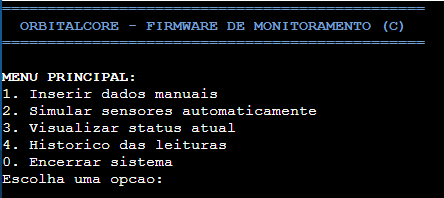
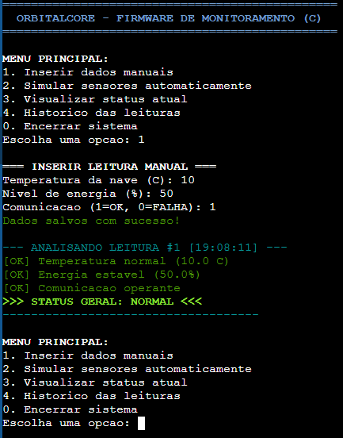
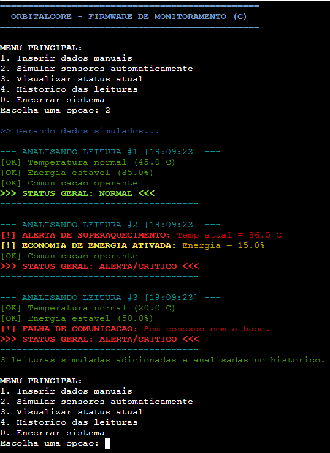
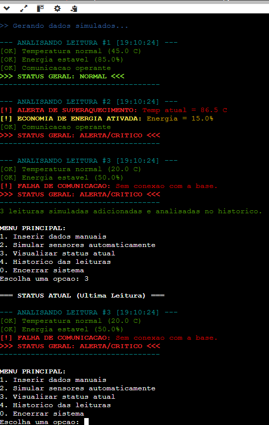
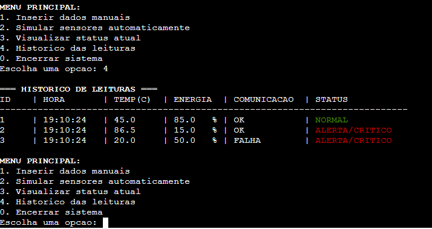

# 🛰️ Módulo DSA: Firmware em C para Monitoramento Espacial

Este diretório contém a implementação da disciplina **DSA (Data Structure and Algorithms)** para o projeto **OrbitalCore**.
O objetivo deste módulo é simular e monitorar o estado operacional de um satélite por meio de telemetria simulada ou entrada manual de sensores, analisando condições críticas de temperatura, bateria e conectividade.

---

## 📁 1. Código-Fonte

O código-fonte principal está contido no arquivo firmware.c.

A aplicação foi desenvolvida em **Linguagem C** pura, utilizando bibliotecas padrão (`stdio.h`, `stdlib.h`, `string.h`, `time.h`) e estilização por códigos de cores ANSI para facilitar o diagnóstico rápido pelo console.

---

## 📊 2. Fluxograma do Sistema

Abaixo está o fluxograma que representa o comportamento lógico do firmware, desde a inicialização do menu principal até os fluxos de inserção de dados, simulação e análises de alertas.


> [!NOTE]
> Você também pode visualizar a definição em código deste fluxograma no formato Mermaid acessando o arquivo [fluxograma.md](fluxograma.md).

---

## 🧠 3. Explicação da Lógica Utilizada

A arquitetura do firmware foi projetada seguindo boas práticas de modularização e estruturação em C:

1. **Estrutura de Dados (`struct`)**:
   - Criamos o tipo estruturado `LeituraSensor` para encapsular de forma unificada os parâmetros de telemetria de uma leitura específica:
     - `int id`: Identificador único incremental da leitura.
     - `float temperatura`: Temperatura atual da nave (°C).
     - `float energia_pct`: Nível de bateria restante (0% a 100%).
     - `int comunicacao_ok`: Estado da conexão (1 para OK / ativo, 0 para FALHA / inativo).
     - `char timestamp[20]`: Horário do registro (capturado dinamicamente do sistema).

2. **Gerenciamento do Histórico em Memória (`Vetor`)**:
   - Um vetor estático `historico` do tipo `LeituraSensor` de tamanho `MAX_LEITURAS` (100) é declarado globalmente.
   - O controle do índice atual do vetor é feito manualmente por meio da variável `total_leituras`, uma vez que a linguagem C não possui coleções dinâmicas nativas (como listas encadeadas ou arrays dinâmicos de redimensionamento automático) sem alocação dinâmica explícita.

3. **Fluxo do Loop Principal (`do-while` & `switch-case`)**:
   - Um menu interativo é exposto dentro de uma estrutura de repetição `do-while`.
   - Há uma proteção no recebimento da opção (`scanf("%d", &opcao) != 1`) que impede loops infinitos caso caracteres inválidos sejam inseridos.

4. **Regras de Negócio e Análise Condicional Sequencial (`if/else`)**:
   - A função `analisar_leitura` realiza análises sequenciais nos parâmetros de forma independente (não encadeada por `else-if`), garantindo que **todos** os alarmes potenciais possam ser ativados simultaneamente caso ocorram.
   - As condições de alerta configuradas são:
     - **Temperatura** > 80.0 °C: Alerta de Superaquecimento (Crítico - Vermelho).
     - **Energia** < 20.0%: Alerta de Economia de Energia (Atenção - Amarelo).
     - **Comunicação** == 0: Alerta de Falha de Comunicação (Crítico - Vermelho).
   - Se todas as condições passarem sem alertas, o status geral do satélite é classificado como `NORMAL`. Caso contrário, é classificado como `ALERTA/CRÍTICO`.

---

## 🖥️ 4. Demonstração Prática do Sistema

_Nesta seção estão ilustradas as telas de execução e validação das funcionalidades do sistema._

### Tela 1: Menu Principal e Inicialização do Sistema

_Espaço reservado para o print do menu principal do sistema logo ao iniciar._



### Tela 2: Inserção Manual de Dados e Alerta Imediato

_Espaço reservado para o print exibindo o preenchimento de dados de sensores manualmente e a análise em tempo real (exemplo de alerta disparado ou leitura OK)._



### Tela 3: Simulação de Sensores (Lote de Telemetria)

_Espaço reservado para o print da execução da opção 2 (Simulação de Sensores), demonstrando a criação automática de 3 cenários de teste (Normal, Crítico e Sem Conexão)._

s

### Tela 4: Visualização do Status Atual (Último Registro)

_Espaço reservado para o print da opção 3, exibindo os detalhes da última telemetria registrada no buffer._



### Tela 5: Histórico Completo de Leituras

_Espaço reservado para o print da opção 4, com a tabela formatada contendo todas as leituras acumuladas até o momento, indicando seus respectivos horários e status gerais._



---

## 🚀 Como Executar

### Opção A: Executar Localmente (GCC / MinGW)

Caso você possua um compilador de C configurado em sua máquina:

1. Abra o terminal na pasta onde o arquivo `firmware.c` está localizado.
2. Compile o código executando:
   ```bash
   gcc firmware.c -o firmware.exe
   ```
3. Inicie o firmware compilado:
   ```bash
   ./firmware.exe
   ```

### Opção B: Executar Online (Sem instalação)

Se preferir rodar diretamente no navegador:

1. Abra e copie todo o conteúdo do arquivo [firmware.c](firmware.c).
2. Acesse o compilador online **OnlineGDB**: [https://www.onlinegdb.com/online_c_compiler](https://www.onlinegdb.com/online_c_compiler)
3. Substitua o código padrão do editor pelo código copiado.
4. Clique no botão verde **Run** (Executar) no painel superior.
5. Utilize o console interativo na parte inferior da página para navegar pelas opções do menu.
